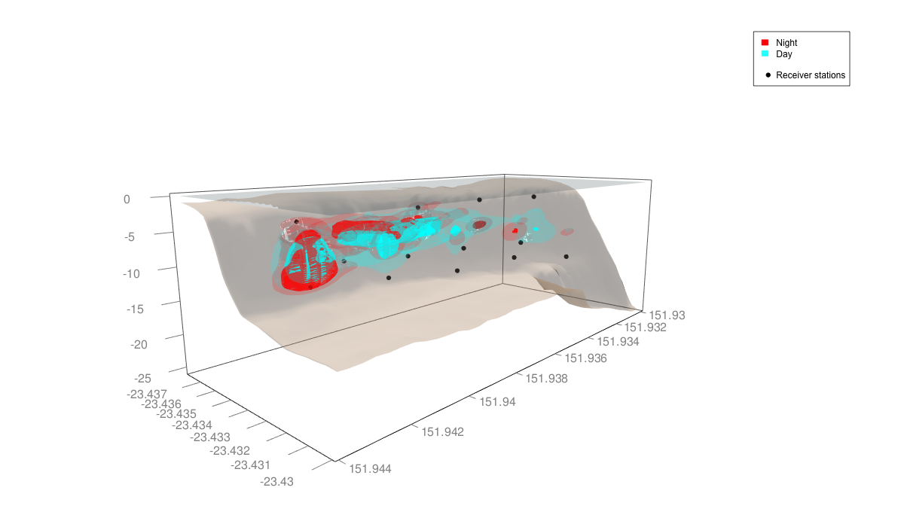

`KUD3D` Package Quick Guide
===================================

The `KUD3D` package consists of helper functions to use in association with the `rayshader` package to visualise 3D kernel utilisation distribution and movement patterns of animals monitored using passive or satellite telemetry.

<br>

Installation
--------------

```r
install.packages("devtools")
devtools::install_github("vinayudyawer/KUD3D")
```

The majority of the 3D bathymetric plotting will be done using the `rayshader` package. If you dont have that already you can install it like so:

```r
install.packages("rayshader")

# To install the latest version from Github (recommended):
devtools::install_github("tylermorganwall/rayshader")
```

<br>

Functions within the package
------------

The `KUD3D` package at the moment comprises of five functions that work in alongside the `rayshader` package:

1.  **`add_bath()`** Displays the shaded map in 3D with the `rgl` package. Altered version of the rayshader `plot_3d()` function to allow adjustment of transparency

2.  **`add_points()`** Helper function to add points or lines a 3D rayshader plot.

3.  **`add_fkud()`** Helper function to add 3DKUD a 3D rayshader plot.

4.  **`add_axes()`** Helper function to add axes to a 3D rayshader plot.

5.  **`vol3d()`** Helper function to calculate 3DKUD volume for a `kde` object.

<br>

Usage
--------------

Apart from the `rayshader` and `KUD3D` packages lets load other helpful packages

```r
sapply(c("ks",
         "rgl",
         "raster",
         "tidyverse",
         "lubridate",
         "sf",
         "rayshader",
         "VTrack",
         "KUD3D"),
       require, character.only = TRUE)

```

Lets set up some common coordinate reference systems that we will be using

```{r, eval=FALSE}
## Common CRS used here
ll<-CRS("+proj=longlat +datum=WGS84")   ## lat/long
utm_heron<-CRS("+init=epsg:32755")      ## projected GBR (in meters)
utm_ningaloo<-CRS("+init=epsg:28348")   ## projected WA (in meters)

```

There are a few example datasets in this package that can help understand how to use the new functions

The walkthrough has been diveded into two parts, plotting and analysing Satellite/GPS telemetry data and Passive acoustic telemetry data.


GPS/Satellite telemetry
-------------------------

Here is an example dataset from a Tiger shark tracked using an high resolution Pop up satellite tag at Ningaloo Reef, Western Australia. This tag also had other sensors that collected a range of other data (i.e. acceleration, magnetometer) but we will only be dealing with the positional data.

```r
## Input and process data
## Detection data
data(GPSdata)

shark_ll <-
  GPSdata %>%
  st_as_sf(coords=c("Longitude","Latitude"), crs=4326)

shark_utm <-
  shark_ll %>%
  st_transform(crs=28348)
```

Example bathymetry data for the region the shark was traked is also provided as an example dataset

```r
## Bathymetry data for Ningaloo Reef
data(ningaloo_bath)

ningaloo_ll<- rasterFromXYZ(ningaloo_bath, crs=ll)

ningaloo_utm <-
  projectRaster(ningaloo_ll, crs=utm_ningaloo) %>%
  crop(.,
       shark_utm %>%
         as_Spatial() %>%
         extent() + 500)
```

Now we have the detection data and bathymetry properly formatted we can start calculating the 3D KUD volumes and visualise them
```r
## 3D KUD calculations

kud_df<-
  shark_utm %>%
  as_Spatial() %>%
  as_tibble() %>%
  transmute(X = coords.x1,
            Y = coords.x2,
            Z = - Depth,
            dt = Date.Time)

H.pi <- Hpi(as.matrix(kud_df[1:3]), binned = TRUE)
fhat <- kde(as.matrix(kud_df[1:3]), H = H.pi)
```

We can use the `vol3d()` helper function in the `KUD3D` package to quickly estimate volume of particular voxels of our animals 3D KUD

```r
vol3d(fhat, cont = 50) ## in m3
vol3d(fhat, cont = 95)
```


Now lets visualise the 3DKUD using the funtions in the `rayshader` package

```r
## Set depth exaggeration
depth_exaggeration <- 0.1

## reconfigure bathymetry data for 3D plotting (** to correct mirrored plotting in rayshader)
bath_mat <-
  as.matrix(ningaloo_utm) %>%
  apply(., 2, rev)


bath_mat %>%
  sphere_shade(texture = "desert") %>%
  add_shadow(ray_shade(bath_mat, zscale = 1/depth_exaggeration), 0.1) %>%
  add_shadow(ambient_shade(bath_mat, zscale = 1/depth_exaggeration), 0.1) %>%
  plot_3d(
    bath_mat,
    baseshape = "rectangle",
    water = T,                 ## render water
    zscale = 1/depth_exaggeration,
    wateralpha = 0.2,
    waterlinecolor = "white",
    waterlinealpha = 0.5,
    windowsize = c(1200, 700),  ## Size of window
    theta = 80, 
    phi = 20,
    fov = 60,
    zoom = 0.8
  )
```


We can use the helper functions in `KUD3D` to overlay the fixed 3DKUD, and an axis on the plot
```r
## Plot 3DKUD ontop of bathymetry
kud_df %>%
  transmute(lat = Y,
            lon = X,
            dep = Z) %>%
  add_fkud(
    ras = ningaloo_utm,
    det = .,
    zscale = 1 / depth_exaggeration,
    cont = c(95, 50),
    alphavec = c(0.1, 0.9),
    drawpoints = T,
    size = 1,
    col.pt = "black",
    colors = c("red","red")
  )

## add axes
add_axes(ningaloo_utm,
         zscale = 1/depth_exaggeration,
         axis.col = grey(0.5))

```


<br>

Passive telemetry data
-------------------------


This example dataset is from a Coral Trout tracked using a passive telemetry array at Heron Island, Australia. We will look at diurnal patterns in space use by this example individual.

```r
## Input and process files
## Station information
data(statinfo)

stat_ll <-
  statinfo %>%
  st_as_sf(coords = c("Longitude", "Latitude"), crs = 4326)

stat_utm <-
  stat_ll %>%
  st_transform(crs = 32755)

## Centre of activity data
data(COAdata)

trout_ll <-
  COAdata %>%
  st_as_sf(coords = c("Longitude.coa", "Latitude.coa"), crs = 4326)

trout_utm <-
  trout_ll %>%
  st_transform(crs = 32755)

## Bathymetry data for Heron Island Reef
data(heron_bath)

heron_ll<-
  rasterFromXYZ(heron_bath, crs=ll) %>%
  raster::disaggregate(x=., fact=3, method='bilinear')

heron_utm<-
  projectRaster(heron_ll, crs=utm_heron) %>%
  raster::crop(.,
       stat_utm %>%
         as_Spatial() %>%
         extent() + 300)
```

Now that the data is correctly formatted, lets calculate 3DKUD like we did for the shark example. We can then use the `vol3d()` helper function in the `KUD3D` package to quickly estimate volume of particular voxels of our animals 3D KUD at night and during the day

```r
## 3D KUD calculations

kud_df<-
  trout_utm %>%
  as_Spatial() %>%
  as_tibble() %>%
  transmute(X = coords.x1,
            Y = coords.x2,
            Z = - Sensor.Value.coa,
            subset =
              factor(
                case_when(
                  lubridate::hour(TimeStep.coa) %in% c(7:17) ~ "Day",
                  lubridate::hour(TimeStep.coa) %in% c(0:6, 18:23) ~ "Night"
                ), levels=c("Night", "Day")))


## Calculate KUD volume during the day
day_df <-
  kud_df %>%
  filter(subset %in% "Day") %>%
  as.matrix()

H.pi_day <- Hpi(day_df[,1:3], binned = TRUE)
fhat_day <- kde(day_df[,1:3], H = H.pi)

vol3d(fhat_day, cont = 50) ## in m3
vol3d(fhat_day, cont = 95)

## Calculate KUD volume during the night
night_df <-
  kud_df %>%
  filter(subset %in% "Night") %>%
  as.matrix()

H.pi_night <- Hpi(df_night[,1:3], binned = TRUE)
fhat_night <- kde(df_night[,1:3], H = H.pi)

vol3d(fhat_night, cont = 50) ## in m3
vol3d(fhat_night, cont = 95)

```


Now lets plot these 3D KUDs over a semi-transparent bathymetry using the helper function `plot_bath()`

```r
## Plotting 3D KUD and bathymetry

## reconfigure bathymetry data for 3D plotting (** to correct mirrored plotting in rayshader)
bath_mat <-
  as.matrix(heron_utm) %>%
  apply(., 2, rev)

## Set depth exaggeration
depth_exaggeration <- 1.5

## Plotting using our modified plot_bath() function to control transparency
bath_mat %>%
  sphere_shade(texture = "desert") %>%
  add_shadow(ray_shade(bath_mat, zscale = 1/depth_exaggeration), 0.1) %>%
  add_shadow(ambient_shade(bath_mat, zscale = 1/depth_exaggeration), 0.1) %>%
  plot_bath(
    bath_mat,
    water = TRUE,      ## render water surface
    zscale = 1/depth_exaggeration,
    waterdepth = 0,
    watercolor = "#88DDFF",
    wateralpha = 0.2,
    windowsize = c(1200, 700),  ## Size of window
    theta = 80,               ## Play around with the theta, phi, fov and zoom to orient the plot (or you can adjust it manually)
    phi = 20,
    fov = 60,
    zoom = 0.8,
    alpha = 0.4              ## transparency of bathymetry
  )
```

We can use the `do()` function to run the `add_fkud()` helper function across all our temporal subsets

```r
## Divides COA data into subsets, calculates KUD and then plots it on bathymetry
kud_df %>%
  group_by(subset) %>%
  transmute(lon = X,
            lat = Y,
            dep = Z) %>%
  do(
    add_fkud(
      ras = heron_utm,
      det = .,
      zscale = 1,
      cont = c(95, 50),                        ## you can add multiple contours, but the plot might get a bit cluttered
      alphavec = c(0.1, 0.7),
      drawpoints = F,
      size = 1,
      col.pt = rainbow(2)[as.numeric(.$subset[1])],
      colors = rep(rainbow(2)[as.numeric(.$subset[1])], 2)
    )
  )
```

Now lets add the receiver stations and an axes for context

```r
## add receiver stations
stat_utm %>%
  as_Spatial() %>%
  data.frame() %>%
  transmute(lon = coords.x1,
            lat = coords.x2,
            dep = - Depth) %>%      ## the depth data for receivers if you have it otherwise you can plot them just under the water surface (-1)
  add_points(ras = heron_utm,
             det = .,
             zscale = 1,
             size = 6,
             col = "black")

## add legend
legend3d("topright",
         legend = c(levels(kud_df$subset), NA , "Receiver stations"),
         border = c(rainbow(2), NA, NA),
         fill = c(rainbow(2), NA, NA),
         pch = c(NA,NA,NA,19),
         col = c(NA,NA,NA,1),
         cex=1, inset=c(0.06))

## add axes
add_axes(heron_utm,
         zscale = 1/depth_exaggeration,
         axis.col = grey(0.5))

```


<br>


The 3D rgl outputs can be saved as snapshots or interactive WebGL html documents. You can even create short movies using spin animations to highlight different activity spaces and animal movements

```r
##### Saving output in different formats (leave rgl window open) #####

### Save output as a .png
snapshot3d("RGLsnapshot.png")

### .GIF animation
movie3d(
  spin3d(axis = c(0, 1, 0), rpm = 1),
  duration = 60,
  fps = 10,
  movie = "Spin animation"
)

### Export rgl window to a web browser
browseURL(paste("file://", writeWebGL(dir = file.path(tempdir(), "webGL")), sep = ""))

### save as a WebGL()
writeWebGL(dir="Interactive plot", snapshot=T)

### Write to .OBJ so can be uploaded to p3d.in server or pdf document
writeOBJ("output.OBJ")

### Write to .PLY and .STL format for 3D printing (combines all objects to one single object)
writePLY("output.PLY")
writeSTL("output.STL")

```

<br>

***More functions to calculate and visualise 3D animal movement coming soon!!***

<br>

# Author

Vinay Udyawer <br> <v.udyawer@aims.gov.au> <br> Australian Institute of Marine Science

<br>

**Vignette version**
0.0.1 (20 Dec 2018)


